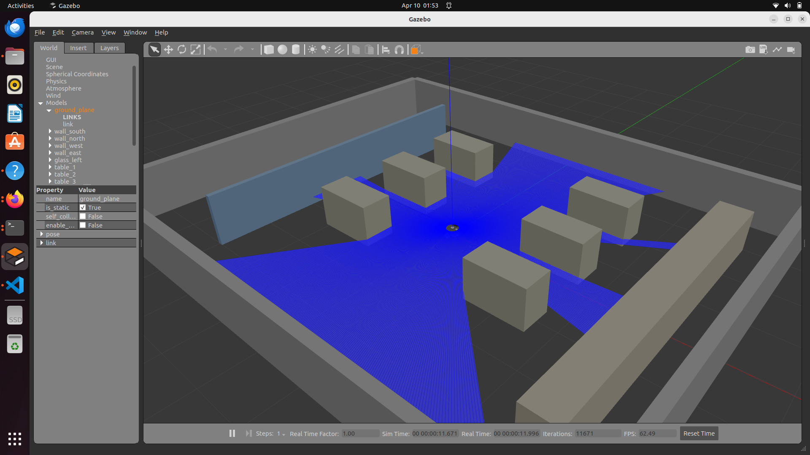
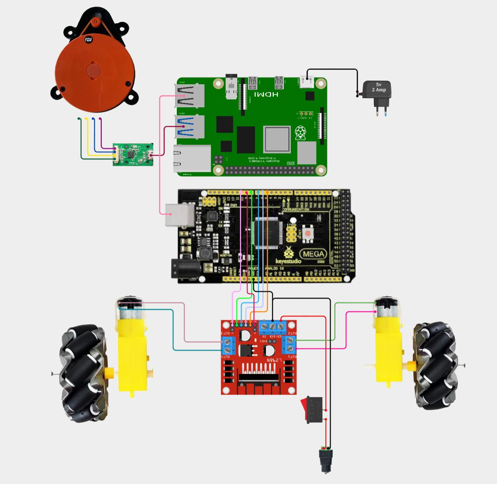
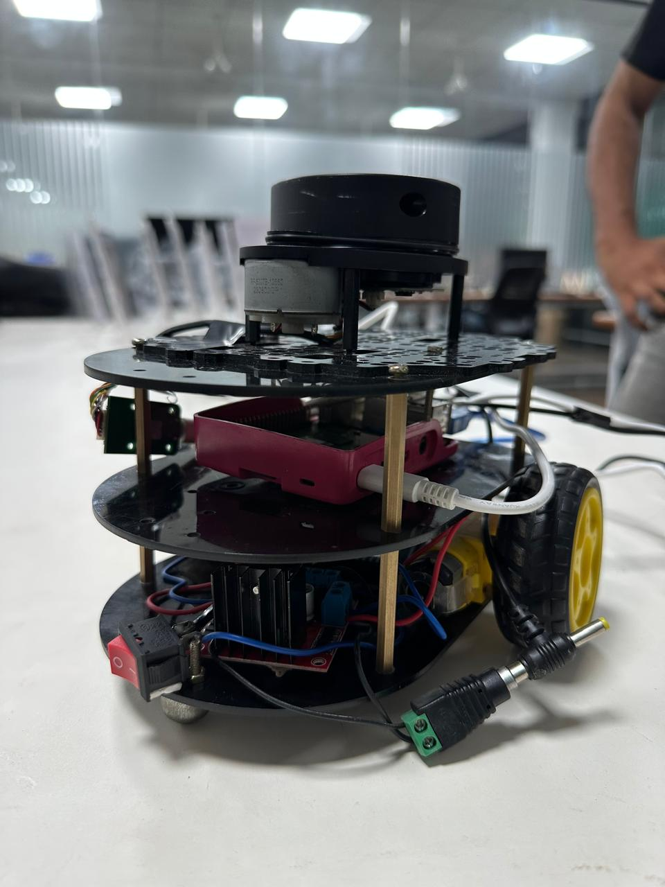

# 🤖 Smart Warehouse AMR with Dynamic Obstacle Avoidance

<div align="center">


**A fully functional Autonomous Mobile Robot (AMR) with real-time LiDAR-based obstacle avoidance,**  
**SLAM mapping, and Nav2 navigation — running in both Gazebo simulation and physical hardware.**

[Simulation](#-simulation-digital-twin) • [Physical Robot](#-physical-robot) • [Setup](#-installation) • [Run](#-running-the-project)

</div>

---

## ⚡ Quick Setup (One-Liners)

> Want to run the project immediately? Open a fresh terminal and paste the relevant command below.  
> It will automatically download the repository, install all ROS 2 and Python requirements, build the workspace, and launch the system!

### 💻 1. Auto-Setup & Run: Simulation (PC/Laptop)

*Use this on your Ubuntu laptop to automatically install Gazebo, Nav2, SLAM toolbox, build the workspace, and launch the digital twin with RViz.*

```bash
mkdir -p ~/amr_ws/src && cd ~/amr_ws/src \
  && git clone https://github.com/LiyanaLatheef/smart-warehouse-amr-obs.git two_wheel_robot \
  && cd ~/amr_ws \
  && sudo apt update \
  && sudo apt install ros-humble-desktop ros-humble-navigation2 ros-humble-nav2-bringup ros-humble-slam-toolbox python3-colcon-common-extensions -y \
  && pip3 install -r src/two_wheel_robot/requirements.txt \
  && source /opt/ros/humble/setup.bash \
  && colcon build \
  && source install/setup.bash \
  && ros2 launch two_wheel_robot simulation.launch.py
```

### 🤖 2. Auto-Setup & Run: Physical Robot (Raspberry Pi)

> ⚠️ **Hardware check:** Ensure RPLiDAR and Arduino are plugged into the Pi's USB ports first.

*Use this on the Pi to automatically download the repo AND the RPLiDAR driver, install Python serial requirements, grant USB port permissions, and launch the hardware brain.*

```bash
mkdir -p ~/robot_ws/src && cd ~/robot_ws/src \
  && git clone https://github.com/LiyanaLatheef/smart-warehouse-amr-obs.git two_wheel_robot \
  && git clone -b ros2 https://github.com/Slamtec/rplidar_ros.git \
  && cd ~/robot_ws \
  && sudo apt update \
  && sudo apt install ros-humble-ros-base python3-colcon-common-extensions -y \
  && pip3 install -r src/two_wheel_robot/requirements.txt --break-system-packages \
  && source /opt/ros/humble/setup.bash \
  && colcon build \
  && sudo chmod 777 /dev/ttyUSB0 \
  && sudo chmod 666 /dev/ttyACM0 \
  && source install/setup.bash \
  && ros2 launch two_wheel_robot physical_robot.launch.py
```

---

## 📌 Project Overview

This project implements a **Smart Warehouse AMR** capable of:

- 🔍 **360° LiDAR sensing** using RPLiDAR A1
- 🧠 **Zone-based obstacle avoidance** (front, left, right zones)
- 🗺️ **SLAM mapping** using `slam_toolbox`
- 🚀 **Autonomous navigation** using Nav2
- 🔄 **Seamless simulation-to-hardware transition** — same ROS2 nodes run on both Gazebo and physical robot

| Feature | Simulation | Physical Robot |
|---|---|---|
| Platform | Ubuntu 22.04 (Laptop) | Raspberry Pi 4 (Ubuntu 22.04) |
| Sensor | Simulated LiDAR | RPLiDAR A1 |
| Motor Driver | Gazebo Diff Drive Plugin | L298N + Arduino Mega |
| Navigation | Nav2 + SLAM Toolbox | avoid.py + vel_smoother |
| Communication | ROS2 Topics | ROS2 + Serial (57600 baud) |

---

## 🎥 Demonstrations


### Gazebo Simulation
<!-- Replace with your actual screenshot -->

*Robot navigating warehouse in Gazebo 11 with LiDAR scan visible*

### RViz Visualization
<!-- Replace with your actual screenshot -->

*Live LiDAR scan and robot model in RViz2*

### SLAM Map
<!-- Replace with your actual screenshot -->
  
*2D occupancy grid map generated using slam_toolbox*

### Circuit Diagram
<!-- Replace with your actual photo -->



### Physical Robot
<!-- Replace with your actual photo -->

*Physical AMR with RPLiDAR A1, Arduino Mega, L298N motor driver on circular chassis*


### Gif

*Moving Bot*  


*working simulation(Gazebo & Rviz)*  


---

## 📁 Repository Structure

```
smart-warehouse-amr-obs/
├── .gitignore
├── README.md
├── requirements.txt                         # Python pip dependencies
├── docs/                                    # Images, GIFs, and media
│   ├── gazebospwn.png
│   ├── rviz.png
│   ├── MAP.png
│   ├── diagram.jpeg
│   ├── physical_robot.jpeg
│   ├── MovingBOT.gif
│   └── GazeboRviz.gif
├── firmware/
│   └── motor_control.ino                    # Arduino Mega motor control
└── src/
    ├── two_wheel_robot/                     # Simulation package
    │   ├── urdf/
    │   │   └── two_wheel_robot.urdf         # Robot description (diff drive + LiDAR)
    │   ├── worlds/
    │   │   └── warehouse.world              # Gazebo warehouse environment
    │   ├── maps/
    │   │   ├── my_warehouse_map.pgm         # SLAM-generated map image
    │   │   └── my_warehouse_map.yaml        # Map metadata
    │   ├── config/
    │   │   ├── nav2_params.yaml             # Nav2 navigation parameters
    │   │   └── slam_params.yaml             # SLAM toolbox parameters
    │   ├── launch/
    │   │   ├── spawn_robot.launch.py        # Robot spawn launch file
    │   │   ├── simulation.launch.py         # Full simulation launch
    │   │   ├── mapping.launch.py            # SLAM mapping launch
    │   │   ├── physical_robot.launch.py     # Physical robot launch
    │   │   └── warehouse_nav2.launch.py     # Nav2 navigation launch
    │   ├── avoid.py                         # Physical robot avoidance (serial)
    │   ├── setup.py
    │   └── package.xml
    ├── obstacle_avoidance/                  # Core logic package (shared: sim + real)
    │   └── obstacle_avoidance/
    │       ├── avoid.py                     # Zone-based obstacle avoidance node
    │       ├── vel_smoother.py              # Velocity ramping for smooth motion
    │       └── waypoint_nav.py              # Waypoint-based navigation
    └── my_robot/                            # Additional robot package
        ├── setup.py
        └── package.xml
```

---

## 🧠 System Architecture

```
┌──────────────────────────────────────────────────────┐
│                  RASPBERRY PI 4                        │
│                                                        │
│  RPLiDAR A1 ──► /scan ──► avoid.py ──► /cmd_vel_raw  │
│                                │                       │
│                          vel_smoother.py               │
│                                │                       │
│                           /cmd_vel ──► serial_bridge   │
│                                              │         │
└──────────────────────────────────────────────┼─────────┘
                                               │ USB Serial
                                               ▼
                                       ARDUINO MEGA
                                               │
                              ┌────────────────┴────────────────┐
                              ▼                                  ▼
                         LEFT MOTOR                        RIGHT MOTOR
                       (L298N OUT1/2)                    (L298N OUT3/4)
```

---

## 🔧 Hardware Components

| Component | Model | Purpose |
|---|---|---|
| Single Board Computer | Raspberry Pi 4 (4GB) | Main robot brain |
| Microcontroller | Arduino Mega 2560 | Motor PWM control |
| Motor Driver | L298N Dual H-Bridge | Drive 2x DC motors |
| LiDAR Sensor | RPLiDAR A1 | 360° obstacle detection |
| Motors | 2x DC Geared Motors | Differential drive |
| Chassis | Circular (custom) | Robot base with caster wheel |

### Wiring Diagram

```
Arduino Pin 5  → L298N IN1     Left Motor  → L298N OUT1, OUT2
Arduino Pin 6  → L298N IN2     Right Motor → L298N OUT3, OUT4
Arduino Pin 7  → L298N IN3
Arduino Pin 8  → L298N IN4     12V Adapter → L298N 12V terminal
Arduino Pin 9  → L298N ENA     L298N GND   → Arduino GND
Arduino Pin 10 → L298N ENB     L298N 5V    → Arduino 5V

RPi USB → Arduino Mega (communication)
RPi USB → RPLiDAR A1 (data)
RPi powered by separate 5V USB-C adapter
```

---

## 💻 Software Stack

| Software | Version | Purpose |
|---|---|---|
| Ubuntu | 22.04 LTS | OS (laptop + RPi) |
| ROS2 | Humble Hawksbill | Robotics middleware |
| Gazebo | 11 | 3D simulation |
| RViz2 | - | Visualization |
| slam_toolbox | - | SLAM mapping |
| Nav2 | - | Autonomous navigation |
| rplidar_ros | ros2 branch | LiDAR driver |
| Python | 3.10 | Node scripting |
| pyserial | ≥3.5 | Arduino communication |

---

## 📦 Requirements

### ROS 2 / System Dependencies (via `apt`)

```bash
sudo apt install ros-humble-desktop -y
sudo apt install ros-humble-navigation2 ros-humble-nav2-bringup -y
sudo apt install ros-humble-slam-toolbox -y
```

### Python Dependencies (via `pip`)

All Python pip dependencies are listed in [`requirements.txt`](requirements.txt):

| Package | Version | Purpose |
|---|---|---|
| `pyserial` | ≥ 3.5 | Serial communication between RPi and Arduino |
| `setuptools` | ≥ 58.0.0 | ROS 2 Python package build system |
| `pytest` | ≥ 7.0 | Running unit tests |

Install with:

```bash
pip3 install -r requirements.txt
```

> **Note:** ROS 2 Python packages (`rclpy`, `sensor_msgs`, `geometry_msgs`, `nav_msgs`) are provided by the ROS 2 Humble installation and are **not** installed via pip.

---

## ⚙️ Installation

### Prerequisites

```bash
# Install ROS2 Humble
sudo apt update
sudo apt install ros-humble-desktop -y
sudo apt install ros-humble-navigation2 ros-humble-nav2-bringup -y
sudo apt install ros-humble-slam-toolbox -y
source /opt/ros/humble/setup.bash
```

### Clone and Build

```bash
# Clone the repository
git clone https://github.com/LiyanaLatheef/smart-warehouse-amr-obs.git
cd smart-warehouse-amr-obs

# Install Python dependencies
pip3 install -r requirements.txt

# Build
colcon build
source install/setup.bash
```

#### 🚀 One-Click Launch (after build)

```bash
# Launch full simulation (Gazebo + RViz + obstacle avoidance)
ros2 launch two_wheel_robot simulation.launch.py
```

### RPi Setup (Physical Robot Only)

```bash
# Install ROS2 Humble on Raspberry Pi (Ubuntu 22.04 aarch64)
sudo apt update && sudo apt install ros-humble-ros-base -y

# Clone repo on RPi
git clone https://github.com/LiyanaLatheef/smart-warehouse-amr-obs.git ~/robot_ws/src/
cd ~/robot_ws

# Install Python dependencies
pip3 install -r src/smart-warehouse-amr-obs/requirements.txt --break-system-packages

# Build
colcon build
source install/setup.bash

# Build RPLiDAR driver from source (fixes buffer overflow on RPi)
cd ~/robot_ws/src
git clone -b ros2 https://github.com/Slamtec/rplidar_ros.git
cd ~/robot_ws
colcon build --packages-select rplidar_ros
source install/setup.bash
```

#### 🚀 One-Click Launch (after build)

```bash
# Grant USB permissions + launch physical robot
sudo chmod 777 /dev/ttyUSB0 && sudo chmod 666 /dev/ttyACM0
ros2 launch two_wheel_robot physical_robot.launch.py
```

### 📋 Available Launch Files

| Launch File | Command | Description |
|---|---|---|
| **Simulation** | `ros2 launch two_wheel_robot simulation.launch.py` | Full Gazebo + RViz digital twin |
| **Physical Robot** | `ros2 launch two_wheel_robot physical_robot.launch.py` | RPLiDAR + obstacle avoidance on Pi |
| **SLAM Mapping** | `ros2 launch two_wheel_robot mapping.launch.py` | Generate warehouse map |
| **Nav2 Navigation** | `ros2 launch two_wheel_robot warehouse_nav2.launch.py` | Autonomous goal navigation |
| **Spawn Only** | `ros2 launch two_wheel_robot spawn_robot.launch.py` | Spawn robot in Gazebo only |

---

## 🚀 Running the Project

### Simulation (Gazebo + RViz)
```bash
🚀 Gazebo & RViz Simulation

Open separate terminals for each step. Be sure to source /opt/ros/humble/setup.bash and source ~/digital_twin_ws/install/setup.bash in each.
```
### Phase 1: Environment & Robot Spawn

**1. Gazebo:**  
`gazebo ~/digital_twin_ws/src/two_wheel_robot/worlds/warehouse.world --verbose -s libgazebo_ros_init.so -s libgazebo_ros_factory.so`

**2. Robot State:**  
`ros2 run robot_state_publisher robot_state_publisher --ros-args -p use_sim_time:=true -p robot_description:="$(xacro ~/digital_twin_ws/src/two_wheel_robot/urdf/two_wheel_robot.urdf)"`

**3. Joint State:**  
`ros2 run joint_state_publisher joint_state_publisher --ros-args -p use_sim_time:=true`

**4. Spawn Entity:**  
`ros2 run gazebo_ros spawn_entity.py -file ~/digital_twin_ws/src/two_wheel_robot/urdf/two_wheel_robot.urdf -entity robot1 -x 0 -y 0 -z 0.1`


### Phase 2: Map & Transformation

**5. Map Server:**  
`ros2 run nav2_map_server map_server --ros-args -p yaml_filename:=~/my_warehouse_map.yaml -p use_sim_time:=true`  
**6. Lifecycle:**  
`ros2 lifecycle set /map_server configure && ros2 lifecycle set /map_server activate`  
**7. Static TF:**  
`ros2 run tf2_ros static_transform_publisher 0 0 0 0 0 0 map odom`  

### Phase 3: Autonomous Logic & Visuals

**8. Obstacle Avoidance:**  
`ros2 run obstacle_avoidance avoid --ros-args -p use_sim_time:=true`  
**9. Velocity Smoother:**  
`ros2 run obstacle_avoidance vel_smoother --ros-args -p use_sim_time:=true`  
**10. RViz2:**  
`rviz2` 
(Add Map, RobotModel, and LaserScan /scan).


### SLAM Mapping (Optional)

```bash
# While simulation is running, launch SLAM
ros2 run slam_toolbox async_slam_toolbox_node --ros-args \
  -p use_sim_time:=true \
  -p odom_frame:=odom \
  -p base_frame:=base_link \
  -p scan_topic:=/scan \
  -p mode:=mapping

# Save map when complete
ros2 run nav2_map_server map_saver_cli -f ~/my_warehouse_map
```

### Nav2 Autonomous Navigation(optional)

```bash
# Load saved map and launch Nav2
ros2 launch nav2_bringup bringup_launch.py \
  use_sim_time:=true \
  map:=/home/liyana/my_warehouse_map.yaml \
  params_file:=/home/liyana/digital_twin_ws/src/two_wheel_robot/config/nav2_params.yaml
```

In RViz: set Fixed Frame → `map`, click **2D Pose Estimate**, then **2D Goal Pose**.

### 🛠️ Physical Hardware Setup

Baud Rate: `115200`  

Serial Commands: `'F'` (Forward), `'L'` (Left), `'R'` (Right), `'S'` (Stop)  

Permissions: Ensure the RPi has access to the USB ports:  
`sudo chmod 777 /dev/ttyUSB0 (LiDAR)`  
`sudo chmod 666 /dev/ttyACM0 (Arduino)`

### Physical Robot (Raspberry Pi)

SSH into your Raspberry Pi and open two terminals:

```bash
# T1 — Launch LiDAR (give it a gentle flick to help motor start)
source /opt/ros/humble/setup.bash
ros2 launch rplidar_ros rplidar_a1_launch.py serial_port:=/dev/ttyUSB0

# T2 — Terminal 2: Hardware Brain (Avoidance Logic)

python3 ~/digital_twin_ws/src/two_wheel_robot/two_wheel_robot/avoid_physical.py

```

---

## 🔍 Core Nodes

### `avoid.py` — Obstacle Avoidance Brain

Subscribes to `/scan`, divides the 360° scan into 3 zones, and publishes velocity commands.

```
Zone Layout (top-down view):
        FRONT (42%–58%)
   LEFT  ←  ROBOT  →  RIGHT
  (58%–75%)          (25%–42%)
```

| Parameter | Value | Description |
|---|---|---|
| `safe_distance` | 0.3m | Full stop + turn threshold |
| `caution_distance` | 0.6m | Slow down + steer threshold |
| `forward_speed` | 0.5 m/s | Normal forward speed |
| `turn_speed` | 0.5 rad/s | Turning angular velocity |

### `vel_smoother.py` — Velocity Smoother

Ramps velocity gradually to prevent jerky motion on physical hardware.

| Parameter | Value |
|---|---|
| Linear acceleration | 0.05 m/s per tick |
| Angular acceleration | Direct (no ramp) |
| Timer rate | Callback-based |

### `serial_bridge.py` — Arduino Communication

Converts ROS2 `/cmd_vel` Twist messages to 2-byte serial commands for Arduino.

```
linear.x → left_byte + right_byte (0–255, center=127)
127 = stop, >127 = forward, <127 = backward
Baud rate: 57600
```

### Arduino `motor_control.ino`

Receives 2 bytes over serial and drives L298N motor driver with PWM.

```cpp
float speed_limit = 1.5;  // 75% max speed (safe for warehouse)
// Deadzone: 124–130 = stop (prevents motor hum)
// constrain(pwm, 0, 255) prevents rollover bug
```
*The `avoid_physical` script (`avoid.py`) utilizes zone-based filtering to make real-time decisions:*

- Chassis Filter: Ignores LiDAR data between `0.2m - 0.3m` to prevent the robot from seeing its own frame.

- Safe Distance: Set to `0.6m` for stable warehouse navigation.

- Decision Logic: If `Front < safe_distance`, the robot compares `Left` vs `Right` clearances and executes a pivot turn toward the more open path via Direct Serial commands.
---

## 🗺️ SLAM Map

The warehouse map was generated using `slam_toolbox` in async mapping mode.


- **Black lines** = walls and shelves detected by LiDAR
- **White areas** = free space (robot can navigate)
- **Grey areas** = unexplored regions
- Map saved as: `src/two_wheel_robot/maps/my_warehouse_map.pgm`

---

## 🐛 Known Issues & Troubleshooting

| Issue | Cause | Fix |
|---|---|---|
| LiDAR buffer overflow | Pre-compiled binary bug on RPi | Rebuild rplidar_ros from source |
| LiDAR timeout error | Power sag on USB | Give LiDAR a gentle flick; unplug Arduino temporarily |
| `/map` frame not found | AMCL not running | Use `bringup_launch.py` not `navigation_launch.py` |
| Robot not moving | `vel_smoother` not running | Always run vel_smoother before avoid |
| Permission denied `/dev/ttyACM0` | Linux USB permissions | Run `sudo chmod 666 /dev/ttyACM0` |
| One motor not working | Thin wire on L298N output | Replace with thicker wire of equal gauge |
| Robot drifts left/right | Motor mismatch | Adjust `right_limit` in Arduino code |

---

## 📊 Project Status

| Feature | Status |
|---|---|
| URDF robot model | ✅ Complete |
| Gazebo warehouse world | ✅ Complete |
| Zone-based obstacle avoidance | ✅ Complete |
| Velocity smoother | ✅ Complete |
| SLAM map generation | ✅ Complete |
| Nav2 navigation (simulation) | ✅ Working (minor tuning needed) |
| Physical robot assembly | ✅ Complete |
| RPLiDAR integration | ✅ Complete |
| Arduino motor control | ✅ Complete |
| Physical obstacle avoidance | ✅ Complete |
| Demo video | ⬜ Pending |

---

## 🔮 Future Work

- Integrate Nav2 goal navigation on physical robot
- Add camera-based object detection for package identification
- Implement multi-robot coordination for fleet management
- Add waypoint-based delivery path planning
- Battery monitoring and auto-docking

---

## 👥 Team

| Name | Register No | Role |
|---|---|---|
| Nafeesath Liyana Latheef | 23BCARI117 | Simulation, Hardware Integration, ROS2 |
| Muhammed Mishal | - | Hardware Assembly, Testing |

**Internal Guide:** Rakesh K K  
**Institution:** Yenepoya Institute of Arts, Science, Commerce and Management  
**Program:** BCA (Artificial Intelligence, Machine Learning, Robotics & IoT)

---
